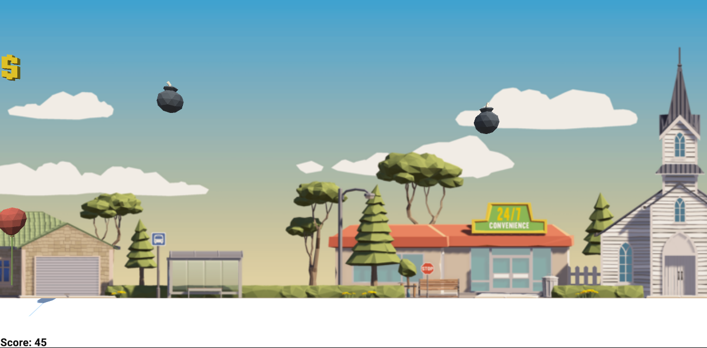

# Convex unity game

This repository hosts code for the Convex Unity game library. 
The root folder (where this README is) contains code to run a sample game while `ConvexLib` contains code for the library itself.

This game uses the `ConvexLib` to interact with the convex network and;
1. Create accounts
2. Create fungible tokens 
3. Mint fungible tokens

### How to develop
1. Clone the REPO
2. Open the folder in Unity Hub
3. Click play in Unity

Copyright (c) 2021 [Superstruct Ltd](https://superstruct.nz/)